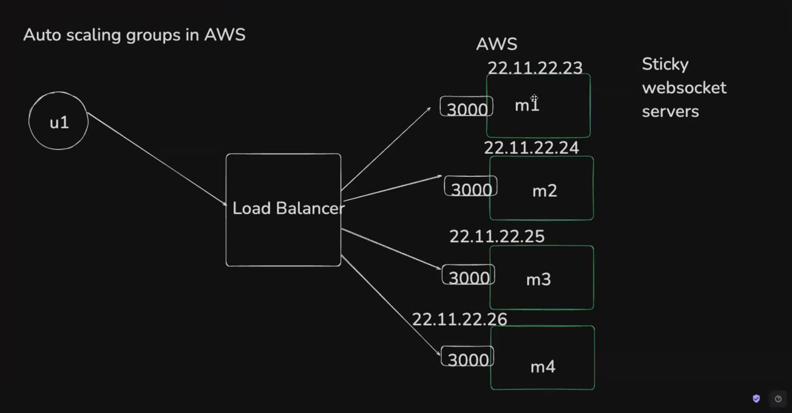
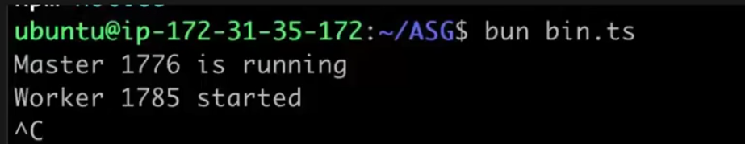
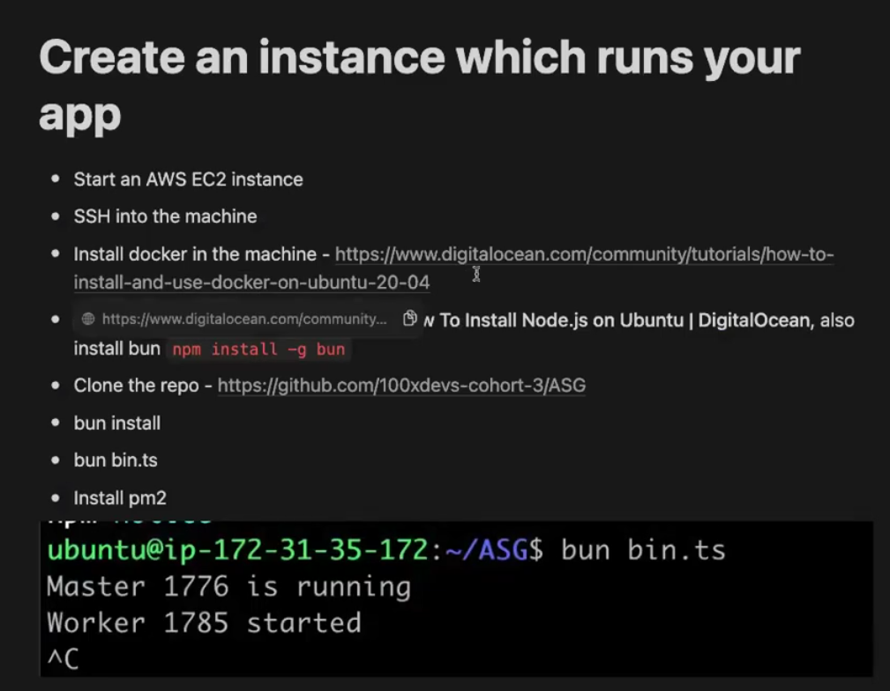
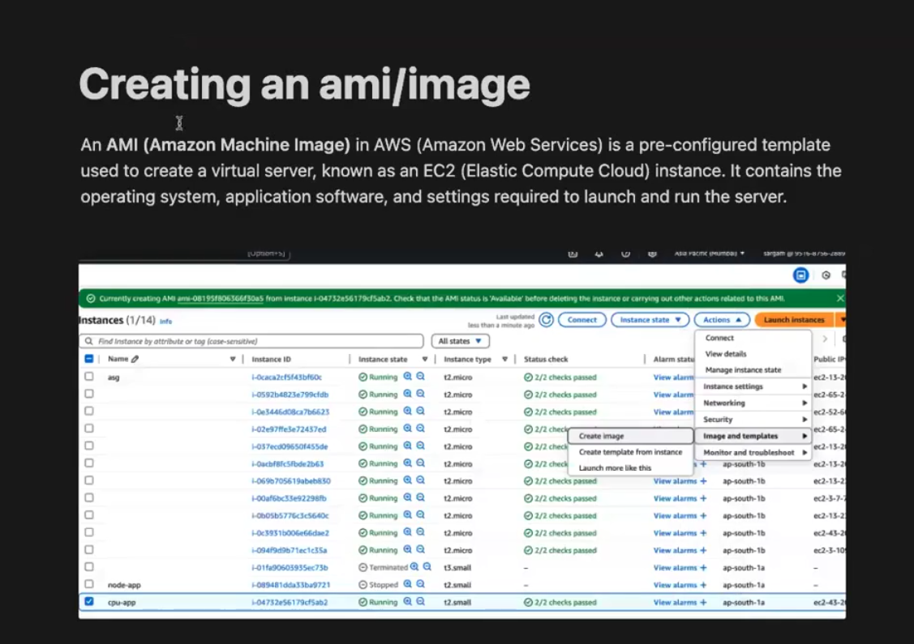
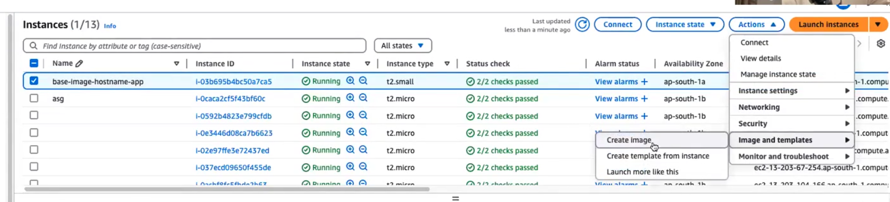
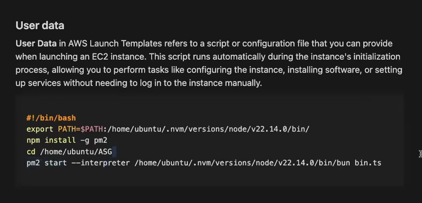
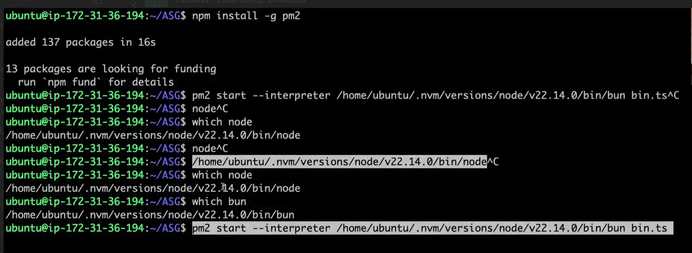
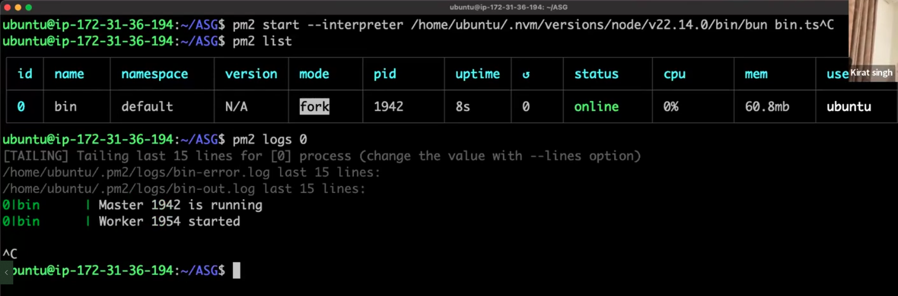

Autoscaling groups

code file --->  https://github.com/100xdevs-cohort-3/ASG.git

Context

ASGs in AWS

Create an instance which runs your app

Creating an ami/image------>

Create a launch template

Create a launch template---->
In AWS, a Launch Template is a resource that defines the configuration settings used to launch EC2 instances. It acts as a blueprint that specifies the instance configuration, such as instance type, Amazon Machine Image (AMI), security groups, key pairs, storage, and other parameters, making it easier to launch instances with predefined configurations.

User data

User Data in AWS Launch Templates refers to a script or configuration file that you can provide when launching an EC2 instance. This script runs automatically during the instance's initialization process, allowing you to perform tasks like configuring the instance, installing software, or setting up services without needing to log in to the Instance manually.

#1/bin/bash

export PATH=$PATH:/home/ubuntu/-wv/versions/mods/v22.14.8/bin/

spe install-g

cd /home/ubuntu/ASG

pal start -interpreter /home/ubuntu/www/versions/node/122.14.9/bin/bun bin.ts

what we have to do in ec2 instance

it will show this 

Create a target group

Create an autoscaling group

Create autoscaling policy